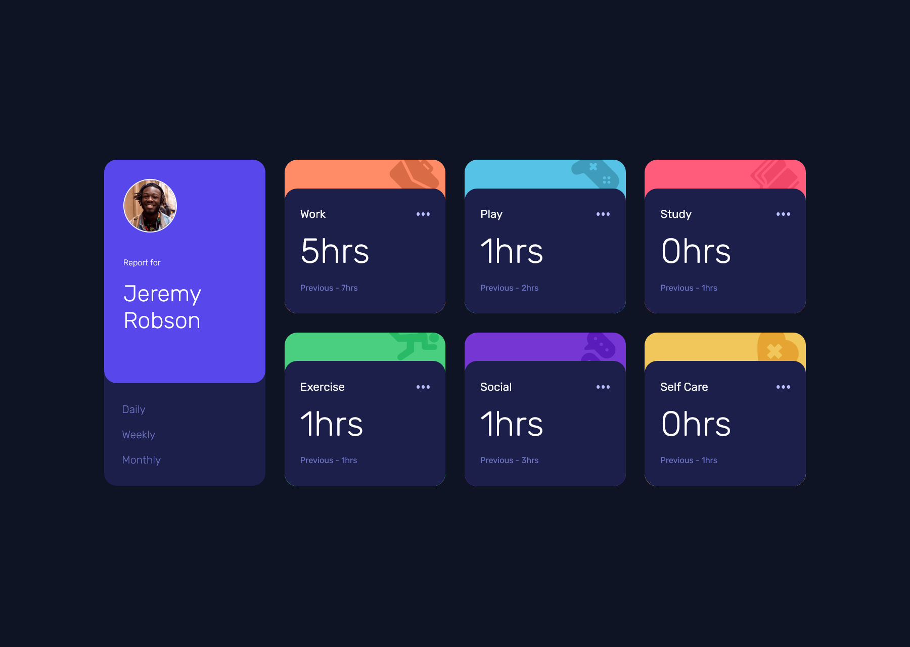

# Frontend Mentor - Time tracking dashboard solution

This is a solution to the [Time tracking dashboard challenge on Frontend Mentor](https://www.frontendmentor.io/challenges/time-tracking-dashboard-UIQ7167Jw). Frontend Mentor challenges help you improve your coding skills by building realistic projects. 

## Table of contents

- [Overview](#overview)
  - [Screenshot](#screenshot)
  - [Links](#links)
- [My process](#my-process)
  - [Built with](#built-with)
  - [What I learned](#what-i-learned)
  - [Continued development](#continued-development)
  - [Useful resources](#useful-resources)
- [Author](#author)
- [Acknowledgments](#acknowledgments)

## Overview

### Screenshot




### Links

- Solution URL: [Solution here](https://github.com/MariaCMontO/time-tracking-cmo)

## My process

### Built with

- Semantic HTML5 markup
- CSS custom properties
- Flexbox
- Grid
- JavaScript
- fetch

### What I learned

With this project, I learned how to include javascript interactions, in this case, the event of click above a text which trigger and effect of changing other texts. I did it using a JSON file, for that, I used fetch to get the data of it. Other important thing I learned with this project is abour regular expressions, like .replace(/\s+/g, '-').

```js
function fetchData(e) {
    const periodo = e.target.id;
    const etiquetas = {
        daily: 'Previous',
        weekly: 'Last Week',
        monthly: 'Last Month'
    }
    //Llamado al JSON
    fetch('data.json')
        .then(response => {
            //Si el estado es NOT FOUND lanza error
            if (!response.ok) {
                throw new Error("No se pudo cargar el JSON");
            }
            // si es correcto devuelve la respuesta como json
            return response.json();
        })
        .then(data => {
            data.forEach(item => {
                //Pasar el titulo para que sea compatible con el id
                const title = item.title.toLowerCase().replace(/\s+/g, '-');
                const { current, previous } = item.timeframes[periodo];

                const currentElement = document.getElementById(`${title}-current`)
                const previousElement = document.getElementById(`${title}-previous`)

                //Validar que los elementos en el DOM existan
                if (currentElement && previousElement) {
                    currentElement.textContent = `${current}hrs`
                    previousElement.textContent = `${etiquetas[periodo]} - ${previous}hrs`
                } else {
                    console.log(`Elemento NO encontrado para ${title}`)
                }
            })
        })
        .catch(error => console.error("Error al cargar datos:", error));
}
```

### Continued development

I definitely want to keep developing interfaces with JavaScript functions, in order to make them more interactive.

### Useful resources

## Author

- Frontend Mentor - [@MariaCMontO](https://github.com/MariaCMontO)


## Acknowledgments
